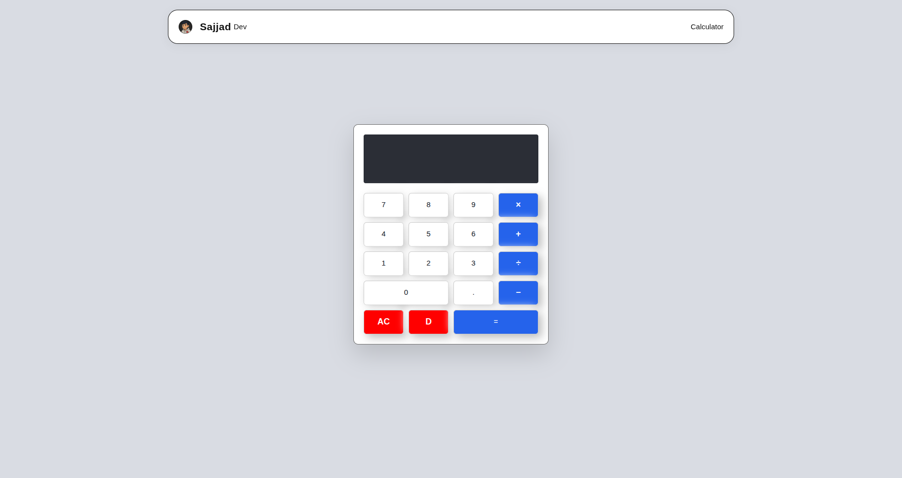

<h1 align="center">🧮 Modern React Calculator App</h1>

  <b>A clean, responsive, and interactive calculator built with React</b> 
  🌐 <a href="https://SajjadR17.github.io/calculator-app/">View Live Demo</a> •
  💾 <a href="https://github.com/SajjadR17/calculator-app">View on GitHub</a>

---

## 🎨 Preview

  

---

## 🧠 About The Project

Modern React Calculator App is a front-end calculator built using React.

This project focuses on:

- Building reusable React components
- Managing state efficiently with React Hooks
- Handling user interactions and edge cases
- Creating a clean and modern UI
- Implementing mathematical logic with proper validation

The goal of this project is to practice component structure, state management, UI consistency, and clean code architecture.

---

## 📊 Project Structure

- 🧮 Display Component
- 🔢 Number Buttons
- ➕ Operator Buttons
- 🟰 Equals Logic
- 🧹 Clear & Delete Functions

Each part is modular and handled with proper state logic.

---

## 🌟 Features

✅ Fully responsive design  
✅ Clean and modern UI  
✅ Basic arithmetic operations (+ − × ÷)  
✅ Decimal support  
✅ Operator validation (prevents double operators)  
✅ Error handling  
✅ Clear (AC) functionality  
✅ Delete / Backspace support  
✅ Keyboard support (optional)  
✅ State management using React Hooks  
✅ Deployed with GitHub Pages

---

## ⚙️ Tech Stack

| Technology        | Usage                        |
| ----------------- | ---------------------------- |
| React             | Component-based architecture |
| JavaScript (ES6+) | Logic & event handling       |
| CSS3              | Styling & responsive layout  |
| CSS Grid          | Button layout structure      |
| GitHub Pages      | Deployment                   |

---

## 🚀 Deployment

This project is deployed using GitHub Pages ⚡️

🔗 Live Demo:  
https://SajjadR17.github.io/calculator-app/

---

## 🧭 How To Run Locally

bash
git clone https://github.com/SajjadR17/calculator-app.git
cd calculator-app
npm install
npm start

---

## 🧾 License

This project is licensed under the MIT License — meaning you're free to use, modify, and share it,  
as long as you give proper credit.
